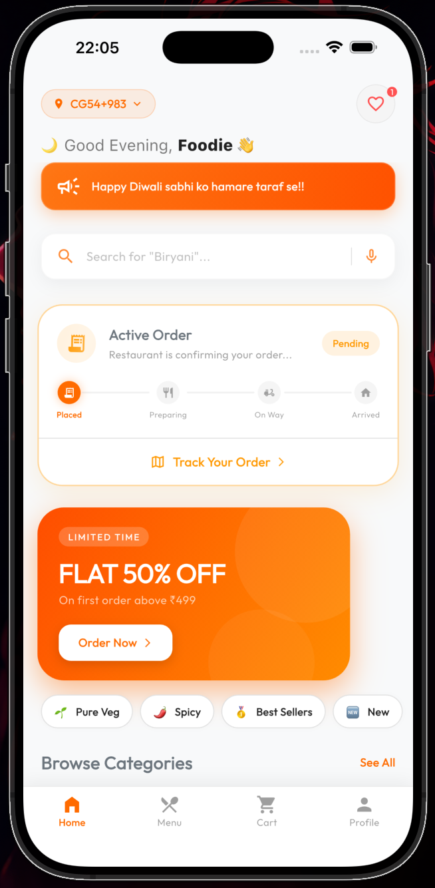
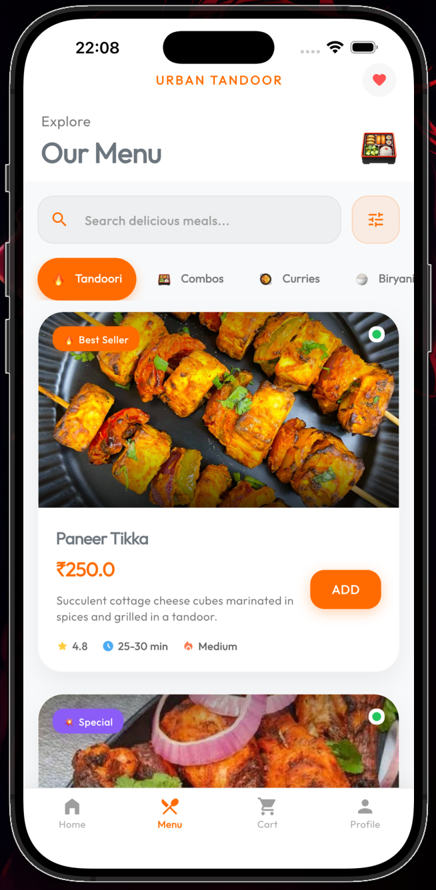
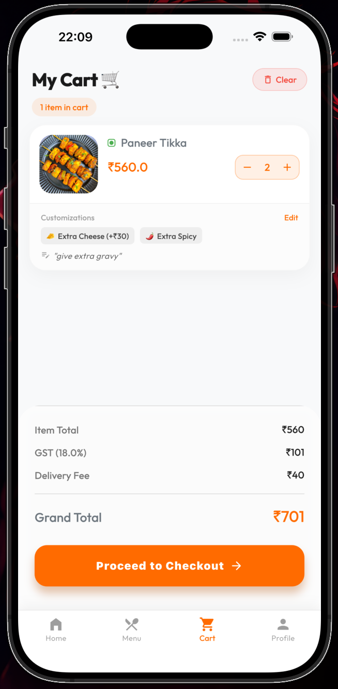

# 🍽 Urban Tandoor — Cross Platform Restaurant App

A scalable Flutter-based restaurant ordering application designed for real-world business usage with Firebase backend and real-time data handling.

---

## 📱 Platform
- Android ✅  
- iOS ✅  

---

## 🚀 Overview
Urban Tandoor is a production-style mobile app that enables users to browse menu items, customize orders, manage cart, and place orders with real-time backend synchronization.

The system is built with a focus on **scalability, modular architecture, and smooth user experience**.

---

## 🧠 Architecture

The app follows a **Modified MVVM architecture** using Provider for state management.

### Structure:
- `core/` → Theme & global configs  
- `models/` → Firestore data models  
- `providers/` → Central business logic (AppProvider)  
- `screens/` → UI layer  
- `services/` → Backend interactions  

---

## 🗺 Routing System

- Uses **Navigator 1.0 (MaterialPageRoute)**
- Dynamic screen navigation via constructor-based data passing
- Central navigation handled via BottomNavigation (MainScreen)

---

## ⚡ State Management

- **Provider (ChangeNotifier)**
- Centralized AppProvider controls:
  - Cart state
  - User session
  - Menu data
  - App settings

### Data Flow:
UI → Provider → Firebase → notifyListeners → UI update

---

## 📡 Backend & API Handling

Fully serverless architecture powered by Firebase:

- Firebase Authentication  
- Cloud Firestore (real-time database)  

### Firestore Structure:
- `food_items` → Menu  
- `categories` → Menu grouping  
- `users` → Profile + cart sync  
- `orders` → Order history  
- `settings/app_config` → Dynamic app control  

### Real-Time Sync:
- Uses Firestore listeners to update UI instantly  
- Admin changes reflect live (e.g., store open/close)

---

## 🍱 Core Features

### 🛒 Smart Cart System
- Map-based storage: `itemId → quantity`
- Supports customizations per item  
- Auto-sync with Firestore (cross-device support)

---

### 📍 Live Location Picker
- Google Maps integration  
- Reverse geocoding for address detection  

---

### 🔐 Authentication & Role System
- Firebase Auth integration  
- Role-based access (User / Admin)  
- Admin dashboard visibility control  

---

## 🎨 UI/UX

- Material 3 based design system  
- Dark/Light theme support  
- Smooth animations using `flutter_animate`  
- Clean and modern UI inspired by food delivery platforms  

---

## 📸 Screenshots

## 📱 iOS Screenshots

  
  
  

---

## 🤖 Android Screenshots

  
  
  

---

## 🚀 Performance & Scalability

### Strengths:
- Lazy loading using `ListView.builder`  
- Real-time updates via Firestore  
- Modular UI structure  

### Why Scalable:
- Backend decoupled (Firebase)  
- Reactive architecture  
- Supports real-time updates and multi-user sync  

---

## ⚠️ Known Limitations

- Centralized provider may grow large  
- Frequent Firestore writes (cart sync)  

---

## 🛠 Future Improvements

- Split providers (Auth, Cart, Menu)  
- Implement repository pattern  
- Add local caching (Hive/SQLite)  
- Migrate to advanced routing (GoRouter)  

---

## 🤝 Developer Notes

This project is designed with a **production mindset**, focusing on:
- Clean architecture  
- Reusable components  
- Real-world business use cases  
- Fast iteration and scalability  

---

## 📬 Contact

GitHub: https://github.com/RahulSarkarCyber